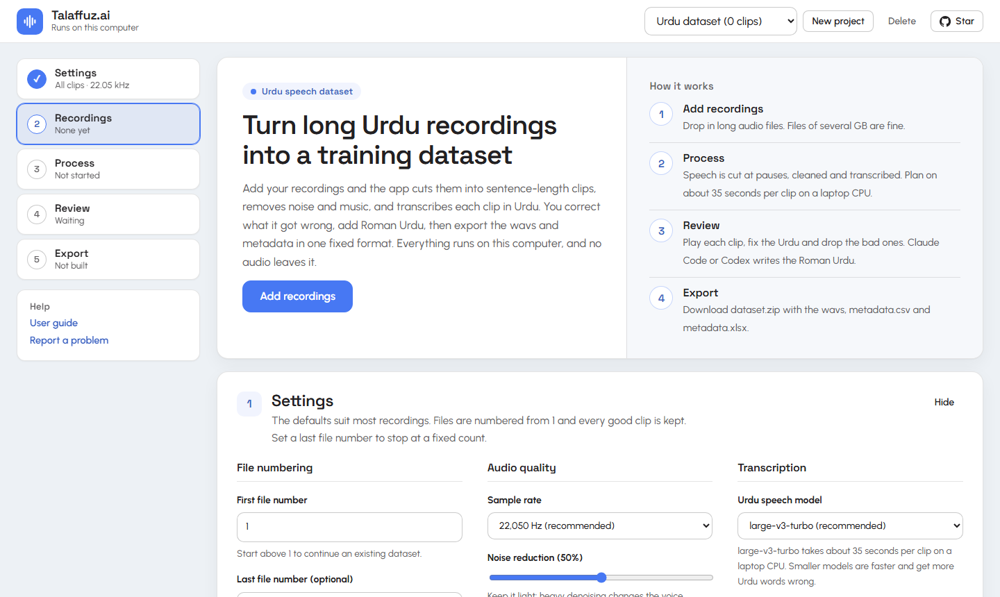
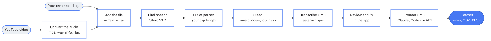
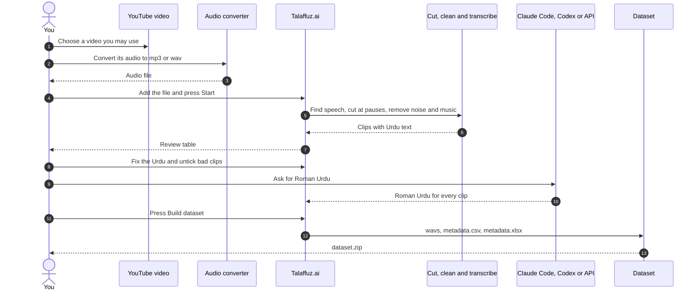
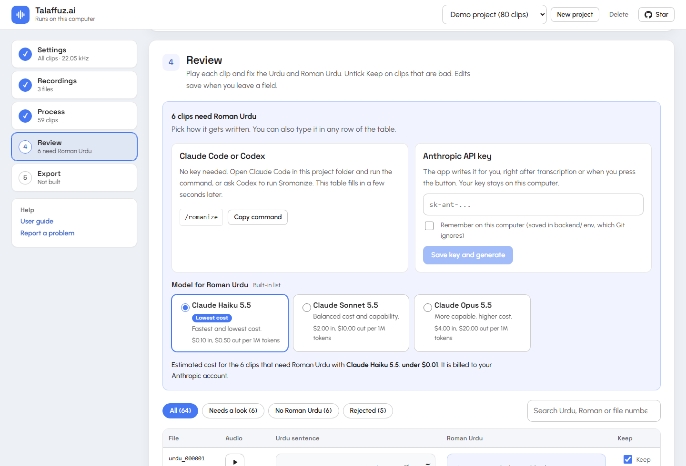

<div align="center">


# Talaffuz.ai

**Turn long Urdu recordings into a ready-to-train speech dataset.**<br>
Sentence-length clips, Urdu transcripts, Roman Urdu and metadata files, all from one app that runs on your own machine.

<a href="https://github.com/XOVO-Technologies/talaffuz.ai/stargazers"></a>
<a href="https://github.com/XOVO-Technologies/talaffuz.ai/fork"></a>
<a href="LICENSE"></a>
<a href="https://github.com/XOVO-Technologies/talaffuz.ai/commits/main"></a>
<a href="https://hits.sh/github.com/XOVO-Technologies/talaffuz.ai/"></a>

<br><br>

<a href="https://xovo-technologies.github.io/talaffuz.ai/"></a>
<a href="https://colab.research.google.com/github/XOVO-Technologies/talaffuz.ai/blob/main/notebooks/talaffuz_ai.ipynb"></a>
<a href="#run-it-with-claude-code"></a>
<a href="#run-it-with-openai-codex"></a>

<br><br>

<a href="#tech-stack"></a>
<a href="#tech-stack"></a>
<a href="#tech-stack"></a>
<a href="#tech-stack"></a>
<a href="#tech-stack"></a>
<a href="#tech-stack"></a>
<br>
<a href="#tech-stack"></a>
<a href="#tech-stack"></a>
<a href="#tech-stack"></a>
<a href="#tech-stack"></a>
<a href="#tech-stack"></a>
<a href="#tech-stack"></a>
<a href="#tech-stack"></a>
<a href="#tech-stack"></a>

<br><br>

<a href="#quick-start">Quick start</a> &nbsp;•&nbsp;
<a href="#what-computer-do-you-need">Requirements</a> &nbsp;•&nbsp;
<a href="#make-a-dataset-from-a-youtube-video">YouTube</a> &nbsp;•&nbsp;
<a href="#features">Features</a> &nbsp;•&nbsp;
<a href="#how-it-works">How it works</a> &nbsp;•&nbsp;
<a href="#using-the-app">Using the app</a> &nbsp;•&nbsp;
<a href="#roman-urdu">Roman Urdu</a> &nbsp;•&nbsp;
<a href="#tech-stack">Tech stack</a> &nbsp;•&nbsp;
<a href="#questions-and-tips">Questions</a> &nbsp;•&nbsp;
<a href="#contributors">Contributors</a> &nbsp;•&nbsp;
<a href="CONTRIBUTING.md">Contribute</a>

<br><br>



</div>

<br>

> [!NOTE]
> You give it long recordings. It gives you `urdu_000001.wav`, `urdu_000002.wav` and so on, plus `metadata.csv` and `metadata.xlsx`, in a fixed format that training code can read directly. It builds datasets only, and your audio stays on the machine that runs the app.

## Quick start

Pick the way that suits you. Each one ends at the same app.

| | Google Colab | Windows PC | Claude Code | OpenAI Codex |
|---|---|---|---|---|
| **Best for** | No install, free GPU | Private recordings, long projects | Letting Claude set it up for you | Letting Codex set it up for you |
| **You need** | A Google account | Windows 10 or 11, [uv](https://docs.astral.sh/uv/), [Node.js](https://nodejs.org/) | [Claude Code](https://claude.com/claude-code), uv, Node.js | [Codex CLI](https://github.com/openai/codex), uv, Node.js |
| **Start** | Open the notebook, then **Runtime > Run all** | `./setup.ps1` then `./start.ps1` | Paste one prompt into Claude Code | Paste one prompt into Codex |

### Run it on Google Colab

[](https://colab.research.google.com/github/XOVO-Technologies/talaffuz.ai/blob/main/notebooks/talaffuz_ai.ipynb)

1. Open the notebook with the button above.
2. Choose **Runtime > Change runtime type** and pick a GPU. A T4 is plenty.
3. Choose **Runtime > Run all**. Allow Google Drive access when Colab asks so your projects are saved between sessions.
4. Open the link that step 5 of the notebook prints. That is the app.
5. After you press **Build dataset**, run the last cell to download `dataset.zip`.

Every notebook cell explains itself. Recordings in Google Drive can be added without uploading: open **Add files that are already on this computer** in the app and paste a path such as `/content/drive/MyDrive/recordings`. A Colab machine is erased when its session ends, so the notebook saves projects to your Drive by default and you press **Continue** after reconnecting.

### Run it on a Windows PC

```powershell
git clone https://github.com/XOVO-Technologies/talaffuz.ai.git
cd talaffuz.ai
./setup.ps1        # Python 3.12 environment, UI build, Whisper model (about 1.6 GB, once)
./start.ps1        # opens http://127.0.0.1:8000
```

Prefer a double-click? Run `start.bat` instead of `start.ps1`.

### Run it with Claude Code

Clone the project, start Claude Code in the folder, and paste this:

```text
Set this project up on my machine by following the README: run ./setup.ps1, then start the app with ./start.ps1 and tell me when http://127.0.0.1:8000 is ready. Later I will ask you to run /romanize to write the Roman Urdu column.
```

`./setup.ps1` also installs the `/romanize` and `/validate-dataset` commands and the proofreading agent into `.claude/`. Restart Claude Code once after setup so it lists them.

### Run it with OpenAI Codex

Clone the project, start Codex in the folder, and paste this:

```text
Set this project up on my machine by following the README: run ./setup.ps1, then start the app with ./start.ps1 and tell me when http://127.0.0.1:8000 is ready. Later I will ask you to romanize the project.
```

`./setup.ps1` also installs the `romanize` and `validate-dataset` skills into `.agents/skills/`. Restart Codex once after setup, then type `$romanize` or `$validate-dataset` to run them. Codex asks before it runs commands, so approve them as they come.

> [!TIP]
> The [live guide](https://xovo-technologies.github.io/talaffuz.ai/) has a **Get started** menu that shows these routes step by step, with copy buttons.

## What computer do you need

Talaffuz.ai runs on an ordinary laptop or desktop. A graphics card is not required.

| | Works | Comfortable |
|---|---|---|
| **System** | Windows 10 or 11, 64-bit. Linux and macOS use the [manual steps](#for-developers). | The same |
| **Processor** | 4 cores | 8 threads or more |
| **Memory** | 8 GB | 16 GB |
| **Disk space** | 5 GB free for the install, plus about 1 GB for every hour of recordings | An SSD with 20 GB or more free |
| **Graphics card** | Not needed | An NVIDIA GPU. The app uses it automatically, and a free Colab T4 is an easy way to get one. |
| **Internet** | Once, to download the models (about 1.7 GB), and for Roman Urdu through Claude, Codex or an API key | The same |
| **Browser** | A current Chrome, Edge, Firefox or Safari | The same |

**The numbers behind the table**

- **Speed, measured on an 8-thread laptop CPU with no GPU:** about 35 seconds per clip to transcribe with large-v3-turbo and about 9 seconds per clip to remove music. That is roughly an hour for every 100 clips, and music removal only runs when a recording has music.
- **Memory, measured:** the app peaks near 2.1 GB while transcribing and near 1.0 GB while removing music.
- **Install size, measured:** about 1.0 GB for the Python environment, 1.6 GB for the Whisper model and 0.1 GB for the music model.
- **Working space:** a recording is copied once as a 44.1 kHz mono working file, about 320 MB per hour, and the clips and the export add roughly the same again, which is where the 1 GB per hour comes from.
- **Making it faster:** a GPU, a smaller Whisper model (`medium` or `small`), or simply letting a long project run overnight. Progress is saved after every clip, so you can stop and continue.

The Works column is a safe floor for the app, not a tested limit, and the Comfortable column is what keeps a long project pleasant.

## Make a dataset from a YouTube video

A voice you want is often in a video. Turn its audio into a file, give the file to Talaffuz.ai, and get a dataset back.

1. **Choose the video.** Pick one where a single person speaks clearly, such as a talk, interview, lecture or podcast. Use audio you own or have permission to use.
2. **Convert the audio.** Save the video's audio as an audio file with the converter or editor you prefer. mp3, wav, m4a and flac all work. If you already have the video file, you can skip this step, because the app also accepts mp4, mkv and webm directly.
3. **Give it to the app.** Open **Recordings**, drop the file in, or use **Add files that are already on this computer** for a large one.
4. **Press Start.** The app finds the speech, cuts clips at pauses, removes noise and background music, and transcribes the Urdu.
5. **Review and build.** Fix the text, add Roman Urdu, and press **Build dataset** to download `dataset.zip` with the wavs, `metadata.csv` and `metadata.xlsx`.

Keep one speaker per project, and start a new project for each voice. The diagrams under [How it works](#how-it-works) show the whole path from the video to the dataset.

## Features

| | |
|---|---|
| **Any audio source** | Your own recordings, podcasts, lectures or the audio of a YouTube video. wav, mp3, m4a, flac, ogg and video files such as mp4, mkv and webm all work. |
| **Cuts at pauses** | Silero VAD finds the speech and clips are cut at pauses, at the length you choose, so a word is never split in half. Up to about a minute per clip works well. |
| **Cleans the audio** | Music is removed only when a recording has some. Noise is reduced lightly, edges are trimmed and loudness is levelled to -23 LUFS. |
| **Urdu transcripts** | faster-whisper writes the Urdu for every clip, then normalises letter forms and punctuation. |
| **Roman Urdu, your way** | Claude Code writes it with `/romanize`, Codex with `$romanize`, or paste an Anthropic API key and the app does it, on the lowest-cost model by default. |
| **A fast review table** | Play a clip, fix the text, search, filter by flags and untick Keep on bad clips. Edits save as you leave a field. |
| **Smart flags** | Repeated words, digits, low confidence, clipping and more are marked so you look at the right clips first. |
| **Numbering you control** | Start at any number to continue an existing dataset. Set a last number to stop at a fixed count, or leave it empty to keep every good clip. |
| **A format that is checked** | The export is re-read after writing and verified before you can download it. |
| **Resume any time** | Progress is saved after every clip. Stop, close the app and continue later. |
| **Runs where you are** | Windows, Google Colab, Claude Code or Codex. CPU or GPU. |

## How it works



1. Each recording is decoded with ffmpeg into a 44.1 kHz mono working copy.
2. Silero VAD finds the speech. Phrases that sit close together are joined and packed into clips of the length you choose, cut only at pauses. Up to about a minute per clip works well.
3. Each clip is cleaned: music removal with Demucs when it is needed, light noise reduction, edge trimming, loudness set to -23 LUFS with the peak under -1 dBFS, then resampling to your chosen rate.
4. faster-whisper transcribes the clip with the language set to Urdu. Obvious failures such as empty or looping output are rejected, and doubtful results get a flag.
5. You review the clips in the app.
6. Roman Urdu is written in one fixed house style.
7. The export writes the files, re-reads them and checks the format.

### From a video to a dataset, step by step



## What you get

```text
dataset/
  wavs/
    urdu_000001.wav
    urdu_000002.wav
    urdu_000003.wav
    ...
  metadata.csv
metadata.xlsx
```

`dataset.zip` holds the `dataset/` folder and `metadata.xlsx`.

- **wavs:** mono, 16-bit PCM, one sample rate for the whole set (22,050 Hz by default), named `urdu_` plus six digits, sequential, with no gaps.
- **metadata.csv:** UTF-8 without a byte-order mark, no header, one line per wav with three fields separated by `|`:

  ```text
  urdu_000001.wav|آج موسم بہت اچھا ہے۔|Aaj mausam bohat achha hai.
  ```

- **metadata.xlsx:** columns `Filename`, `Urdu Sentence`, `Roman Urdu` and `Final`. `Final` is the formula `=A2&"|"&B2&"|"&C2` filled down, so it rebuilds each CSV line.

A row's wav, Urdu text and Roman Urdu always belong together. The `|` character is removed from all text because it is the separator. Numbers are assigned at export time from the clips you kept, in recording order, so the set never has gaps even after you reject clips.

Numbering starts at 1 and every good clip is kept. Set the **first file number** to continue an existing dataset (start at 501 if you already have 500 files). Set a **last file number** to stop at a fixed count, for example files 101 to 300 of a shared dataset.

## Using the app

The page follows the order of the work. Number tiles at the top show recordings, clips ready, clips that need Roman Urdu and clips that need a look. A list of five steps on the side marks where you are, and clicking one jumps to it. Once a project has clips, the Settings and Recordings cards fold into a summary line so processing and review come first. Press **Edit** or **Show** to open them again.



### 1. Settings

The defaults suit most recordings. Files are numbered from 1 and every good clip is kept. The page shows the resulting file names under the numbering fields. Everything is explained in the [settings reference](#settings-reference). Settings save when you press Start or Continue.

### 2. Recordings

Drag audio files onto the drop area or click it to choose files. Audio taken from a YouTube video works too, see [Make a dataset from a YouTube video](#make-a-dataset-from-a-youtube-video). wav, mp3, m4a, flac, ogg, opus, aac, wma, mp4, mkv and webm all work, and so does anything else ffmpeg can decode. Files stream straight to disk, so several GB is fine, and the default limit is 8 GB per file.

Files already on the machine, such as a Google Drive folder in Colab or a big file on your disk, can be added without uploading. Open **Add files that are already on this computer**, paste the path of a file or a folder, and press Add. Use recordings of one speaker, since the dataset is meant for a single voice.

### 3. Cut and transcribe

Press **Start**. The app finds the speech, then cleans and transcribes the clips one at a time with a progress bar and a time-left estimate.

- **Stop** halts the job after the current clip. **Continue** picks up where it stopped.
- **Process 50 more clips** raises the goal by 50 good clips when candidates are left.
- **Re-segment** cuts the recordings again after you change clip length or speech detection settings.

### 4. Review

Play each clip, fix the Urdu and Roman Urdu, and untick **Keep** on any clip you do not want. Filters switch between all clips, clips that need a look, clips without Roman Urdu and rejected clips, and the search box matches Urdu, Roman text and file numbers. A clip marked **extra** is a kept clip beyond your last file number and is left out of the export.

<details>
<summary>What the flags mean</summary>

| Flag | Meaning |
|---|---|
| empty | Nothing was recognised. The clip is rejected automatically. |
| repetition | Repeated words, usually a recognition loop. Rejected automatically. |
| not urdu script | Mostly not Urdu letters. |
| digits | The text has digits. Spell numbers out in words for text-to-speech. |
| too little text | Very little text for this much audio, so words may be missing. |
| too much text | More text than the audio can hold. Check for made-up words. |
| low confidence | The model was unsure. |
| maybe not speech | The clip may be noise or music. Rejected automatically when it is also low confidence. |
| noisy | Low signal-to-noise ratio. |
| clipping | The audio peaks too hard. |

</details>

### 5. Export

The checklist shows how many clips are ready, how many still need Roman Urdu and how many are flagged. Press **Build dataset**. The export asks for an Urdu sentence and Roman Urdu on every row it writes and lists any that are missing, and **Export anyway** writes the files regardless when you want a partial result. After writing, the app re-reads the files and checks the format, then offers `dataset.zip`, `metadata.xlsx` and `metadata.csv`. The same files stay in `data/projects/<id>/output/`.

### Projects

The selector in the header switches between projects. Use **New project** to keep another speaker or batch separate, and **Delete** to remove a project and its files.

## Roman Urdu

Roman Urdu has no standard spelling, so the house style is fixed in one place, `STYLE_GUIDE` in [backend/app/pipeline/romanize.py](backend/app/pipeline/romanize.py), and every route below uses it.

<details>
<summary>The house style in brief</summary>

- ASCII letters only. Capital letter at the start of a sentence and for proper names. Urdu punctuation maps one to one (۔ becomes `.`, ؟ becomes `?`, ، becomes `,`).
- Long vowels: `aa` (kaam), `ee` in the middle of a word (theek), `oo` (hoon), `ai` (hai), `au` (aur). Final ی in words like ki, hi, bhi is `i`.
- Nasal noon at the end of a word is `n` (hain, main, yahan). Aspirated consonants keep the `h` (bhi, phir, khana).
- Fixed spellings for common words: hai, hain, hoon, tha, thi, kya, yeh, woh, aur, nahi, mujhe, aap, bohat, theek, daftar.
- English loan words written in Urdu script use normal English spelling (mobile, office, bank).

</details>

Pick whichever route suits you. They can be mixed, and none of them overwrites text you typed.

### With Claude Code, no key

Open Claude Code in this folder while the app is running and type `/romanize`. Claude reads the style guide, fetches every kept clip that has Urdu but no Roman Urdu, converts them in batches and saves them back. The review table fills in a few seconds later. Add a project id (`/romanize <id>`) when you have several projects.

### With OpenAI Codex, no key

Open Codex in this folder while the app is running and type `$romanize`. Codex reads the same style guide, fetches every kept clip that has Urdu but no Roman Urdu, converts them in batches and saves them back. The review table fills in a few seconds later. Name the project when you have several, for example `$romanize for project 1a2b3c`.

### With an Anthropic API key

In the **Review** step, paste your key and press **Save key and generate**. The app checks the key, then writes Roman Urdu right after transcription and whenever you press **Generate missing Roman Urdu**.

- **Remember on this computer** saves the key in `backend/.env`, which Git ignores. Leave it unticked to keep the key for this session only. **Remove key** forgets it.
- The key is never sent back to the browser and never written to logs, project files or exports.
- You can also set `ANTHROPIC_API_KEY` in `backend/.env` yourself.

**Choose the model.** The options are listed in the app with their prices, read from your Anthropic account once the key is set. The default is the lowest-cost model, and an estimate for the clips that still need Roman Urdu is shown before you generate.

| Model | Price per 1M tokens (input / output) | Estimated cost for 500 clips |
|---|---|---|
| **Claude Haiku 5.5** (default, lowest cost) | $0.10 / $0.50 | about $0.02 |
| Claude Sonnet 5.5 | $2.00 / $10.00 | about $0.39 |
| Claude Opus 5.5 | $4.00 / $20.00 | about $0.78 |

The estimates assume clips of about six seconds, are rounded up, and use Anthropic's list prices. The app reduces cost further by sending short ids, turning off extra reasoning on Haiku, and batching 50 clips per request.

### By hand

Type it into the Roman Urdu field of any row.

For a second pair of eyes before export, ask Claude Code to run the `urdu-proofreader` agent. It reads your transcripts and reports rows that look wrong, such as likely recognition slips, Arabic letter forms where Urdu forms belong, and Roman text that does not match the Urdu word for word. It never edits anything.

## Settings reference

<details>
<summary>Every setting and its default</summary>

| Setting | Default | What it does |
|---|---|---|
| First file number | 1 | Number of the first wav. Raise it to continue an existing dataset. |
| Last file number | empty | Optional. Empty keeps every good clip. A number caps the dataset at last minus first plus one clips. |
| Extra clips to process | 15 % | Only used with a last file number. Processes this much beyond the target so rejects can be replaced. |
| Sample rate | 22,050 Hz | Output rate. Also 16,000, 24,000 and 44,100. |
| Noise reduction | 50 % | Strength of the spectral denoiser. Light settings keep the voice natural. |
| Background music | Auto | Auto tests the first three clips of each recording and runs the separator only when it removes real music. On always runs it. Off never does. |
| Urdu speech model | large-v3-turbo | Whisper model. `large-v3` is the most accurate. `medium` and `small` are faster. |
| Write Roman Urdu automatically | on | Takes effect when an API key is set. |
| Shortest clip | 2.5 s | Clips are packed to at least this length. Set whatever your training needs. |
| Longest clip | 14 s | Clips never exceed this length. Your choice: up to about 1 minute works well. |
| Join phrases closer than | 0.9 s | Speech segments with a smaller gap are merged before packing. |
| Pause that splits speech | 400 ms | Silence at least this long ends a speech segment. |
| Speech threshold | 0.5 | Silero VAD sensitivity, from 0.1 to 0.9. Lower picks up quieter speech. |
| Padding around speech | 250 ms | Added at both ends of a speech segment so soft consonants are kept. Clips are then trimmed to at most 150 ms of edge silence. |
| Loudness | -23 LUFS | Target integrated loudness. The peak is held at -1 dBFS. |

The last seven sit under **Clip length and speech detection** and apply to recordings analysed afterwards. Use Re-segment to redo ones already cut.

**Exact-length clips.** Set the shortest and longest clip to the same value and the app cuts fixed windows on the clock instead of at pauses. Use it when a spec needs a fixed length.

</details>

## Tech stack

The badges at the top of this page link here.

| Layer | Tools | What they do here |
|---|---|---|
| Speech detection | Silero VAD | Finds the speech and the pauses to cut at |
| Music and noise | Demucs (htdemucs), noisereduce | Keeps the voice and removes music and background noise |
| Loudness | pyloudnorm | Levels every clip to the same loudness |
| Transcription | faster-whisper, Whisper large-v3-turbo | Writes the Urdu for each clip |
| Roman Urdu | Claude Code, OpenAI Codex or the Anthropic API | Writes Roman Urdu in one fixed style |
| Backend | FastAPI, Uvicorn, Pydantic | Projects, uploads, jobs, progress events, export |
| Frontend | React 19, TypeScript, Vite | The review app, in Space Grotesk and Urbanist |
| Export | openpyxl, soundfile | The CSV, the Excel sheet, the wavs and the zip |
| Where it runs | Windows, Google Colab, Claude Code, OpenAI Codex | Your choice of home |

## Where your files go

<details>
<summary>The data folder and optional settings</summary>

Everything lives under `data/`, which Git ignores.

```text
data/projects/<project id>/
  project.json      settings, recordings, clips and their text
  uploads/          the files you added
  work/             44.1 kHz mono working copy of each recording
  clips/            one processed wav per clip
  output/           the last export
    dataset/        wavs/ and metadata.csv
    metadata.xlsx
    dataset.zip
```

Point the app somewhere else with the `DATASET_DATA_DIR` environment variable. `backend/.env` (created by setup) holds a few optional values:

| Variable | Default | Purpose |
|---|---|---|
| `ANTHROPIC_API_KEY` | empty | Enables Roman Urdu through the API. You can also paste it in the app. |
| `ROMANIZE_MODEL` | `claude-haiku-5-5` | The model that writes Roman Urdu. You can also choose it in the app. |
| `MAX_UPLOAD_GB` | `8` | Largest accepted upload. |

</details>

## Questions and tips

<details>
<summary>Do I need a GPU or an API key?</summary>

No to both. The app runs on a CPU, and a GPU such as the free T4 in Colab is the fastest route. Roman Urdu can come from Claude Code or Codex with no key, from your own typing, or from an API key if you want it automatic.

</details>

<details>
<summary>Where does my audio go?</summary>

It stays on the machine that runs the app, which is your PC or the Colab machine you started. When Roman Urdu is written through Claude Code, Codex or an API key, only the Urdu sentences are sent to the assistant you chose.

</details>

<details>
<summary>How do I check a finished dataset?</summary>

The export checks itself. To check any folder, run:

```powershell
backend/.venv/Scripts/python.exe backend/scripts/validate_dataset.py <folder with wavs/ and metadata.csv> --start 1 --sr 22050
```

It verifies the CSV encoding and field counts, sequential names, that every row has a wav and every wav has a row, Urdu script in the second column, ASCII in the third, and mono 16-bit PCM at one sample rate. In Claude Code, `/validate-dataset` does the same for your newest project, and so does `$validate-dataset` in Codex.

</details>

<details>
<summary>How do I run the scripts if PowerShell blocks them?</summary>

Run `powershell -ExecutionPolicy Bypass -File .\setup.ps1`, or start the app with `start.bat`, which handles it for you.

</details>

<details>
<summary>How do I use a bigger file or a different port?</summary>

Set `MAX_UPLOAD_GB` in `backend/.env` and restart. To change the port, edit the two `8000` values in `start.ps1`. For development also change the proxy target in `frontend/vite.config.ts`.

</details>

<details>
<summary>How do I update to the latest version?</summary>

Run `git pull`, then `./setup.ps1 -SkipModels` to refresh the packages and rebuild the page. Press `Ctrl+F5` in the browser.

</details>

<details>
<summary>How do I get the Nastaliq font for Urdu text?</summary>

The page loads Noto Nastaliq Urdu from Google Fonts. To use it offline, install the font on your computer.

</details>

<details>
<summary>How do I pick up where I stopped?</summary>

Start the app again and press **Continue**. Clips finished before the stop are kept, and a recording that was mid-analysis is analysed again.

</details>

<details>
<summary>How do I change the file numbering?</summary>

Press **Edit** on the Settings card, set the first file number, and set or clear the last one. Projects created with the early default range of 31 to 500 that have not been exported yet are moved to numbering from 1 with no upper limit when the app starts, so older projects follow the current defaults too. Press `Ctrl+F5` after updating so the browser loads the latest page.

</details>

<details>
<summary>Manual setup for Linux and macOS</summary>

```bash
uv venv --python 3.12 backend/.venv
uv pip install --python backend/.venv/bin/python -r backend/requirements.txt
(cd frontend && npm install && npm run build)
backend/.venv/bin/python -c "from faster_whisper.utils import download_model; download_model('large-v3-turbo')"
cp backend/.env.example backend/.env
mkdir -p .claude && cp -r integrations/claude-code/skills integrations/claude-code/agents .claude/
mkdir -p .agents && cp -r integrations/codex/skills .agents/

cd backend
PYTHONUTF8=1 .venv/bin/python -m uvicorn app.main:app --port 8000
```

Then open <http://127.0.0.1:8000>. The skills and the `urdu-proofreader` agent call `backend/.venv/Scripts/python.exe`. In the copies under `.claude/` and `.agents/`, change that path to `backend/.venv/bin/python`.

</details>

## The live guide

The `site/` folder is a static guide for the project, published on [GitHub Pages](https://xovo-technologies.github.io/talaffuz.ai/) or Vercel. A **Get started** menu offers Google Colab, Claude Code, OpenAI Codex and Windows PC with step-by-step instructions and copy buttons, and the page lists the output format, every setting, a live GitHub star count and a short FAQ. The app itself always runs on your own machine, so the published site is a guide and nothing is processed on it. A deep link such as `/#run=claude` opens a specific guide.

## For developers

The backend is FastAPI on Python 3.12 and the frontend is React with Vite and TypeScript.

```text
backend/
  app/main.py          routes
  app/pipeline/        segmenter, enhance, transcribe, text_ur, romanize, export, process
  app/jobs.py          single-worker job runner with progress events
  app/store.py         JSON-file project store
  scripts/             pending_roman, apply_roman, validate_dataset
  tests/
frontend/
  src/App.tsx          page and data flow
  src/components/      settings, uploader, clip table, Roman Urdu panel, export, dialogs
  src/config.ts        repository name for the star button and help links
  src/styles.css       design tokens and styles
site/                  static guide for GitHub Pages or Vercel
notebooks/             the Google Colab notebook
integrations/          skills and the proofreading agent for Claude Code and Codex (setup.ps1 installs them)
```

```powershell
./start.ps1 -Dev                                          # API with reload on :8000, UI with hot reload on :5173
backend/.venv/Scripts/python.exe -m pytest backend        # backend tests
cd frontend; npm run build                                # type-checks and builds the UI
```

<details>
<summary>API reference</summary>

Interactive docs are served at <http://127.0.0.1:8000/docs> while the app runs.

| Method and path | Purpose |
|---|---|
| `GET /api/health` | ffmpeg, device and Roman Urdu availability |
| `GET /api/projects`, `POST /api/projects` | List and create projects |
| `GET /api/projects/{id}`, `DELETE /api/projects/{id}` | Read and delete a project |
| `PUT /api/projects/{id}/settings` | Save settings |
| `PUT /api/projects/{id}/sources?filename=` | Upload a recording (raw body) |
| `POST /api/projects/{id}/sources/import` | Copy an audio file, or the audio files in a folder, from a path on the server |
| `DELETE /api/projects/{id}/sources/{sid}` | Remove a recording and its clips |
| `POST /api/projects/{id}/process` | Start the cut, clean and transcribe job (`{"extra": 50}` raises the goal) |
| `POST /api/projects/{id}/resegment` | Discard clips and cut again |
| `POST /api/projects/{id}/romanize` | Roman Urdu through the API (needs a key) |
| `GET /api/projects/{id}/romanize-estimate` | Estimated tokens and cost for the clips that need Roman Urdu |
| `POST /api/projects/{id}/cancel` | Stop the running job |
| `GET /api/projects/{id}/events` | Server-sent progress events |
| `PATCH /api/projects/{id}/clips/{cid}` | Edit Urdu, Roman Urdu or Keep |
| `POST /api/projects/{id}/clips/bulk?fill_only=true` | Patch many clips, filling only empty Roman Urdu |
| `GET /api/projects/{id}/clips/{cid}/audio` | The processed clip as wav |
| `POST /api/projects/{id}/export` | Build the dataset (`{"force": true}` skips the error stop) |
| `GET /api/projects/{id}/download/{zip,csv,xlsx}` | Download the last export |
| `GET`, `PUT`, `DELETE /api/anthropic-key` | Read whether a key is set, set it, remove it. The key is never returned |
| `GET /api/anthropic-models`, `PUT /api/anthropic-model` | List the Roman Urdu models with prices and choose one |

</details>

## Contributors

<div align="center">

<table>
  <tr>
    <td align="center" width="260">
      <a href="https://github.com/sufiinamulhassan"></a>
      <br><br>
      <b>Inam Ul Hassan</b>
      <br><br>
      <a href="https://github.com/sufiinamulhassan"></a>
      <br>
      <a href="https://github.com/XOVO-Technologies/talaffuz.ai/commits?author=sufiinamulhassan"></a>
    </td>
    <td align="center" width="260">
      <a href="https://github.com/syedakinzabatool"></a>
      <br><br>
      <b>Syeda Kinza Batool</b>
      <br><br>
      <a href="https://github.com/syedakinzabatool"></a>
      <br>
      <a href="https://github.com/XOVO-Technologies/talaffuz.ai/commits?author=syedakinzabatool"></a>
    </td>
  </tr>
</table>

</div>

## Add your code

Have a fix, a new feature or a better sentence in the docs? Add your code and open a pull request. We will review it and merge it once it is ready.

1. **Fork** the repository and create a branch for your change.
2. **Make the change** and run the two checks in [CONTRIBUTING.md](CONTRIBUTING.md#before-you-open-a-pull-request).
3. **Open a pull request** that says what changed and how you tested it.

<div align="center">

<a href="https://github.com/XOVO-Technologies/talaffuz.ai/fork"></a>
<a href="https://github.com/XOVO-Technologies/talaffuz.ai/compare"></a>
<a href="https://github.com/XOVO-Technologies/talaffuz.ai/issues"></a>
<a href="CONTRIBUTING.md"></a>

</div>

Please follow the [code of conduct](CODE_OF_CONDUCT.md), and report security issues as described in [SECURITY.md](SECURITY.md).

## Star history

<a href="https://star-history.com/#XOVO-Technologies/talaffuz.ai&Date">
  
</a>

## License

Released under the [MIT license](LICENSE). If you use the app to build a dataset, the [citation file](CITATION.cff) has the details for referencing it.

## Credits

[Whisper](https://github.com/openai/whisper) by OpenAI run through [faster-whisper](https://github.com/SYSTRAN/faster-whisper) from SYSTRAN, [Silero VAD](https://github.com/snakers4/silero-vad), [Demucs](https://github.com/facebookresearch/demucs), [noisereduce](https://github.com/timsainb/noisereduce), [pyloudnorm](https://github.com/csteinmetz1/pyloudnorm), [FastAPI](https://fastapi.tiangolo.com/), [React](https://react.dev/) and [Vite](https://vite.dev/). Space Grotesk and Urbanist (SIL Open Font License) set the interface, and Noto Nastaliq Urdu sets the Urdu text.

<div align="center">

<br>

If this project saves you time, a star on GitHub helps other people find it.

<a href="https://github.com/XOVO-Technologies/talaffuz.ai"></a>
&nbsp;
<a href="https://hits.sh/github.com/XOVO-Technologies/talaffuz.ai/"></a>

</div>
